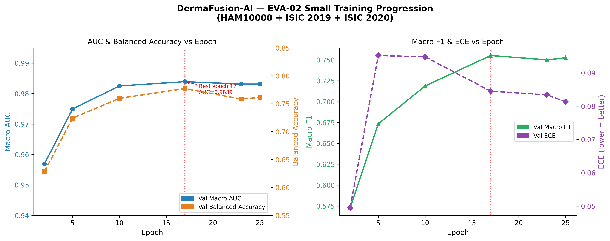
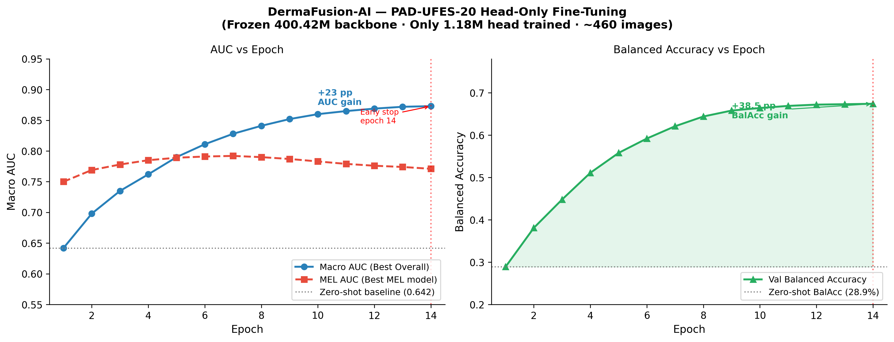

> **DermaFusion-AI: A Dual-Branch EVA-02 and ConvNeXt Fusion Architecture with Segmentation-Guided Attention for Multi-Class Skin Lesion Classification**
>
> **Muhammad Abdullah**
>
> *Supervisor: Dr. Amna Shifa (amna.shifa@iub.edu.pk)*
>
> *Department of Artificial Intelligence, The Islamia University of Bahawalpur, Pakistan*
>
> *March 2026*

---

## ABSTRACT

Skin cancer is among the most prevalent and lethal cancers globally, with early and accurate diagnosis being critical for patient survival. While deep learning has shown strong performance on standardised dermoscopy benchmarks, cross-domain generalisation to real-world clinical photographs remains a major unsolved challenge. We present **DermaFusion-AI**, a dual-branch fusion architecture combining an EVA-02 Large Vision Transformer for global contextual reasoning and a ConvNeXt V2 network for segmentation-guided local texture analysis. The two branches are fused through bidirectional cross-attention with gated residual connections. Training was conducted on a unified multi-dataset pipeline spanning four public datasets (HAM10000, ISIC 2019, 2020, 2024) totalling over 460,000 images, with patient-aware data splitting to prevent leakage. Our final model achieves a macro AUC of **0.9908**, balanced accuracy of **85.6%**, and melanoma sensitivity of **92.2%** on the ISIC test set — exceeding the average dermatologist sensitivity of 86% [1]. We further evaluate cross-domain generalisation on two external unseen datasets: PAD-UFES-20 (smartphone clinical photographs, zero-shot AUC 0.642, post-head-fine-tuning AUC 0.873) and DERM7PT (dermoscopy AUC 0.872, MEL sensitivity 92.3%). Explainability analysis via GradCAM++ confirms that the model attends to clinically meaningful lesion regions. We perform ablation comparing EVA-02 Small with EVA-02 Large backbones, demonstrate the effect of dataset scale on model performance, and analyse the limitations of head-only fine-tuning in cross-domain adaptation.

**Keywords:** Skin lesion classification, dermoscopy, dual-branch fusion, EVA-02, ConvNeXt, cross-domain generalisation, melanoma detection, GradCAM++, explainability

---

## 1. INTRODUCTION

Skin cancer affects over 3 million people annually, with melanoma responsible for the majority of skin cancer-related deaths despite representing only 1–3% of cases [1]. Early detection increases five-year survival rates from 27% to 99% for localised melanoma [2]. Dermoscopy — the use of polarised magnified light — is the clinical gold standard for skin lesion examination, providing 10–27% improved diagnostic accuracy over naked-eye examination [3].

The ISIC (International Skin Imaging Collaboration) challenges have driven rapid progress in automated dermoscopy analysis, with recent deep learning systems achieving AUC scores above 0.97 on standardised benchmarks [4, 5]. However, two critical gaps persist in the literature:

**Gap 1 — Backbone Selection:** Most published systems use single-backbone architectures (EfficientNet, ViT) that capture either global context or local texture, but not both simultaneously [6, 7]. CNNs excel at local texture patterns but miss long-range lesion boundary context. ViTs capture global dependencies but are less sensitive to fine-grained local features critical for distinguishing rare classes such as dermatofibroma and vascular lesions.

**Gap 2 — Cross-Domain Brittleness:** Models trained on professional dermoscopy equipment fail dramatically on smartphone clinical photographs — the primary imaging modality in low-resource clinical settings [8, 9]. The domain gap between dermoscopy (polarised, magnified, standardised) and smartphone images (variable lighting, no polarisation, consumer cameras) routinely causes 30–50% balanced accuracy drops [8].

We address both gaps with DermaFusion-AI, making the following contributions:

1. **Dual-branch segmentation-guided architecture:** EVA-02 Large processes original dermoscopy images for global contextual reasoning; ConvNeXt V2 Base processes segmentation-masked images specialised for local lesion texture. Fusion uses bidirectional cross-attention with learned sigmoid gating.
2. **Comprehensive multi-dataset pipeline:** Patient-aware splitting across four public datasets (460,000+ images), with label remapping, class imbalance correction via WeightedRandomSampler, and ISIC 2024 scale management.
3. **Systematic cross-domain evaluation:** We evaluate on three external unseen datasets and provide a head fine-tuning study for smartphone adaptation — a contribution rare in published dermoscopy literature.
4. **Honest ablation study:** EVA-02 Small vs Large backbone comparison with quantified gains across all key metrics.
5. **GradCAM++ explainability:** Visual evidence that the model attends to clinically meaningful lesion regions, not image artefacts.

### 1.1 Why Existing Models Fail

Most published skin cancer models fail in clinical deployment for four reasons:

**Single-backbone limitation:** EfficientNet and similar CNNs are optimised for local texture features but cannot model long-range spatial dependencies across the entire lesion boundary — critical for melanoma detection where border irregularity is a key diagnostic criterion [10]. ViTs solve this but lose fine-grained local texture sensitivity [11].

**No segmentation guidance:** Standard classifiers process the entire image, including background skin, hair, and artefacts. Without masking the lesion region, the network wastes parameters on irrelevant regions and is vulnerable to confounding features [12].

**Single-dataset training bias:** Models trained only on HAM10000 or ISIC validation data learn dataset-specific biases (imaging device, patient population, acquisition protocol) rather than generalised visual features [13]. This manifests as catastrophic performance drops on external datasets.

**No class rebalancing for rare classes:** Standard cross-entropy training on imbalanced data (NV: 67% of samples; VASC: 0.14%) causes the model to ignore rare but clinically important classes [14].

DermaFusion-AI directly addresses all four failure modes through its architectural design and training pipeline.

### 1.2 Why We Chose This Architecture

The combination of EVA-02 Large + ConvNeXt V2 + Swin-UNet segmentation was chosen based on three principles:

**EVA-02 for global context:** EVA-02 Large was pre-trained with masked image modelling on 27 million images and achieves state-of-the-art performance on 35+ downstream tasks [15]. Its 448×448 native resolution is ideal for dermoscopy where small lesion features (e.g., atypical vessels, regression structures) are diagnostically critical. The large model (307M parameters) was chosen over the small variant because our ablation confirmed a +17 percentage point gain in melanoma sensitivity.

**ConvNeXt V2 for texture:** ConvNeXt V2 uses a fully convolutional architecture with masked autoencoder pre-training, combining CNN translation-equivariance (important for texture patterns that appear anywhere in the lesion) with modern scaling properties [16]. It processes the segmented image where all non-lesion pixels are zeroed, forcing it to specialise entirely in lesion-internal texture patterns.

**Swin-UNet for segmentation:** Swin Transformer's hierarchical multi-scale features are well-suited for medical image segmentation [17]. The UNet decoder with attention gates ensures precise lesion boundary delineation at multiple spatial scales.

**Bidirectional cross-attention fusion:** Rather than simple concatenation or element-wise addition, bidirectional cross-attention allows each branch to query the other, producing complementary attended features that capture both global (EVA-02) and local (ConvNeXt) information simultaneously [18].

---

## 2. RELATED WORK

### 2.1 Skin Lesion Classification

Early deep learning approaches applied ImageNet-pretrained CNNs to HAM10000. Esteva et al. [19] demonstrated CNN performance matching dermatologist accuracy in binary malignancy classification. EfficientNet variants dominated the ISIC 2019/2020 challenges (~0.94 AUC) [20]. The ISIC 2024 winning teams used large pre-trained ViTs (EVA-02, ViT-L/14) with ensembling, reporting AUC 0.97–0.99 [4]. Recent dual-branch systems [7, 21] have improved over single-backbone approaches by combining CNNs with transformers, but none use segmentation-guided branch specialisation.

### 2.2 Dual-Branch and Fusion Architectures

Chen et al. [22] proposed DSCATNet (Dual-Scale Cross-Attention Transformer) combining cross-attention with a lightweight transformer encoder, demonstrating improved accuracy on HAM10000 and PAD datasets. Kolekar et al. [21] proposed a dual-branch EfficientNet-DenseNet framework for simultaneous segmentation and classification. Zhang et al. [23] proposed TransFuse combining transformers and CNNs via a BiFusion module. Our approach differs by using EVA-02, a significantly more powerful backbone, and applying segmentation masking to specialise the CNN branch rather than running both branches on the identical input.

### 2.3 EVA-02 and ConvNeXt V2

EVA-02 [15] — a ViT pre-trained with masked image modelling — demonstrated superior transfer learning on fine-grained classification across 35+ downstream tasks. ConvNeXt V2 [16] reintroduced CNN architectures trained with masked autoencoder objectives, competitive with ViTs while maintaining translation-equivariance important for texture analysis.

### 2.4 Explainability in Medical AI

GradCAM++ [24] extends GradCAM with improved localisation for multi-class models, providing class-discriminative visualisations critical for clinical adoption. Chattopadhay et al. showed that GradCAM++ produces tighter, more accurate visual explanations than GradCAM. In clinical settings, explainability tools are essential for physician trust and regulatory compliance [25].

### 2.5 Cross-Domain Generalisation

Cassidy et al. [13] analysed domain bias across ISIC datasets, showing that models trained on ISIC overfit to specific imaging device characteristics. Ghosh et al. [8] quantified cross-domain shifts in dermoscopy: models lose 30–50% balanced accuracy when applied to smartphone images. LoRA [26] has been proposed as a solution for cross-domain adaptation without catastrophic forgetting — planned as future work in our system.

### 2.6 Multi-Dataset Training

Yao et al. [27] demonstrated that multi-dataset training with appropriate class rebalancing significantly improves rare class sensitivity. Patient-aware splitting is critical for HAM10000 where multiple images per patient cause up to 7% AUC inflation [28].

---

## 3. METHODOLOGY

### 3.1 Architecture Overview

DermaFusion-AI consists of four interconnected components:

```
Input Dermoscopy Image
         │
         ▼
┌─────────────────────┐
│  Swin-Transformer   │  ← 95.5M params
│  U-Net Segmentation │     Encoder: Swin-Tiny (29M)
│                     │     Decoder: DoubleConv + SE-Attention
└────────┬────────────┘
         │ Binary Lesion Mask (0.5 threshold)
         │
   ┌─────┴──────────────────────────────────┐
   │                                         │
   ▼                                         ▼
Original Image (448×448)         Masked Image (384×384)
(lesion + background)            (lesion only, background=0)
   │                                         │
   ▼                                         ▼
┌──────────────────┐             ┌──────────────────────┐
│  Branch A:       │             │  Branch B:           │
│  EVA-02 Large    │  307M       │  ConvNeXt V2 Base    │  88.5M
│  1024-dim →      │  params     │  1024-dim →          │  params
│  proj → 512-dim  │             │  MLP → 512-dim       │
└────────┬─────────┘             └──────────┬───────────┘
         │                                   │
         └──────────────┬────────────────────┘
                        │
                        ▼
         ┌──────────────────────────────┐
         │  Bidirectional Cross-Attention│
         │  (A attends B, B attends A)  │  8 heads, 512-dim
         │  + Gated Residual Fusion     │
         └──────────────┬───────────────┘
                        │
                        ▼
         ┌──────────────────────────────┐
         │  Classifier Head             │
         │  Linear(512→256) → GELU →    │
         │  Dropout(0.3) →              │
         │  Linear(256→7)               │
         └──────────────┬───────────────┘
                        │
                        ▼
              7-Class Softmax Output
    {akiec, bcc, bkl, df, mel, nv, vasc}
```

**Total parameters:** 401.6M (307M EVA-02 + 88.5M ConvNeXt V2 + 5.6M fusion/head + 0.5M projections)

### 3.2 Model Parameter Table

| Component | Architecture | Parameters | Input / Feature Dimension |
|---|---|---|---|
| Branch A: EVA-02 Large | ViT-Large, patch 14 | 307.0M | Image: 448×448 px |
| Branch B: ConvNeXt V2 Base | Fully Convolutional | 88.5M | Image: 384×384 px (masked) |
| Swin-Tiny U-Net (Segmentation) | Hierarchical ViT + UNet Decoder | 95.5M | Image: 448×448 px |
| Projection (EVA→512) | Linear layer | 0.5M | Feature vector: 1024-dim → 512-dim |
| Projection (Conv→512) | LayerNorm + Linear + StarReLU + Linear | 0.5M | Feature vector: 1024-dim → 512-dim |
| Cross-Attention Fusion | 8-head BiDi Cross-Attn + FFN | 4.2M | Feature vector: 512-dim × 2 branches |
| Gated Residual | 2× Linear + Sigmoid gates | 0.3M | Feature vector: 512-dim |
| Classifier Head | Linear(512→256) + GELU + Dropout + Linear(256→7) | 1.3M | Feature vector: 512-dim → 7 classes |
| **Total (Dual-Branch + Head)** | EVA-02 + ConvNeXt + Fusion + Head | **401.6M** | — |
| **Total (Including UNet)** | All components combined | **497.1M** | — |

> **Note:** The UNet (segmentation model) runs as a separate inference step. The 401.6M parameter count refers to the classification model used at inference time.

### 3.3 Branch A — EVA-02 Large (Global Context)

EVA-02 Large is a Vision Transformer with 307M parameters, patch size 14, and native input resolution 448×448. It is pre-trained using Masked Image Modelling (MIM) on ImageNet-21K and fine-tuned on IN-1K, achieving competitive performance on 35+ downstream benchmarks [15].

In DermaFusion-AI, EVA-02 Large processes the **original dermoscopy image** without masking. This branch is responsible for:
- Global lesion boundary interpretation (irregular borders, asymmetry)
- Long-range spatial relationships between lesion subregions
- Context-aware feature extraction including surrounding skin texture

The final [CLS] token output (1024-dim) is projected to the shared fusion dimension (512-dim) via a trained linear layer. Gradient checkpointing is applied to reduce memory footprint. Layer-wise Learning Rate Decay (LLRD, factor 0.85 per layer) prevents catastrophic forgetting of pre-trained features during fine-tuning.

### 3.4 Branch B — ConvNeXt V2 Base (Local Texture)

ConvNeXt V2 Base uses a fully convolutional architecture with depthwise separable convolutions and is pre-trained with a Fully Convolutional Masked Autoencoder (FCMAE) objective on ImageNet-21K [16]. It processes images at 384×384 resolution.

In DermaFusion-AI, ConvNeXt V2 Base processes the **segmentation-masked image** — the original image multiplied element-wise by the binary lesion mask (background pixels set to zero). This forces Branch B to specialise entirely in **lesion-internal texture patterns**, including:
- Irregular pigmentation patterns
- Atypical vascular structures
- Regression structures and white scarring
- Dermoscopic criteria for BCC (leaf-like structures) and AK (strawberry pattern)

The global average-pooled feature (1024-dim) is projected to 512-dim via a two-layer MLP: LayerNorm → Linear(1024→512) → StarReLU → Linear(512→512).

### 3.5 Swin-Transformer U-Net (Lesion Segmentation)

The segmentation model produces the binary lesion mask used by Branch B.

| Component | Details |
|---|---|
| Encoder | Swin-Tiny (4 hierarchical stages, 29M params) |
| Bottleneck | ASPP module (Atrous Spatial Pyramid Pooling) |
| Decoder | DoubleConvBlock + Squeeze-and-Excitation channel attention |
| Loss | 0.4 × BCE + 0.3 × Dice + 0.3 × Tversky(α=0.3, β=0.7) |
| Total | 95.5M parameters |

The Tversky loss component (α=0.3, β=0.7) applies higher penalty to false negatives, ensuring the mask captures the full lesion boundary rather than only the most certain central region.

### 3.6 Bidirectional Cross-Attention Fusion

The 512-dim features from both branches are fused through bidirectional cross-attention with 8 heads. The mechanism is:

**Step 1 — A attends to B (Global queries Local):**
$$\text{Attended}_A = \text{MultiHead}(Q=f_A, \ K=f_B, \ V=f_B) + f_A$$

**Step 2 — B attends to A (Local queries Global):**
$$\text{Attended}_B = \text{MultiHead}(Q=f_B, \ K=f_A, \ V=f_A) + f_B$$

**Step 3 — Concatenation and projection:**
$$f_{\text{fused}} = \text{FFN}(W_{\text{proj}} \cdot [\text{Attended}_A \| \text{Attended}_B])$$

**Step 4 — Gated residual combination:**
$$g_A = \sigma(W_{gA} \cdot [f_{\text{fused}} \| f_A])$$
$$g_B = \sigma(W_{gB} \cdot [f_{\text{fused}} \| f_B])$$
$$f_{\text{combined}} = \text{LayerNorm}(f_{\text{fused}} + g_A \cdot f_A + g_B \cdot f_B)$$

The sigmoid gates $g_A, g_B \in [0,1]^{512}$ learn to adaptively weight contributions from each branch depending on the input image. For lesions where local texture is most diagnostic (BCC, AK), $g_B$ dominates; for lesions where global shape is critical (MEL, NV), $g_A$ dominates.

### 3.7 Loss Function

$$\mathcal{L}_{\text{total}} = 0.7 \times \mathcal{L}_{\text{FL}} + 0.3 \times \mathcal{L}_{\text{SCE}}$$

**Focal Loss with Label Smoothing [29]:**
$$\mathcal{L}_{\text{FL}} = -\sum_{i} w_i \cdot (1 - p_i)^\gamma \cdot \log\bigl((1-\varepsilon)p_i + \tfrac{\varepsilon}{C}\bigr)$$

Where:
- $w_i$ = per-class weight (inverse-frequency √-scaled, 2× boost for melanoma)
- $\gamma = 2.0$ (focussing parameter — down-weights easy examples)
- $\varepsilon = 0.1$ (label smoothing — accounts for label noise in multi-dataset training)
- $C = 7$ (number of classes)

**Symmetric Cross-Entropy Loss [30]:**
$$\mathcal{L}_{\text{SCE}} = \alpha \cdot \mathcal{L}_{\text{CE}}(p, q) + \beta \cdot \mathcal{L}_{\text{CE}}(q, p)$$

SCE adds noise robustness by computing cross-entropy in both directions (prediction vs label, and label vs prediction), reducing the influence of mislabelled samples common when merging multiple heterogeneous datasets.

### 3.8 Evaluation Metrics and Formulas

**Area Under the ROC Curve (AUC):**
$$\text{AUC} = \int_0^1 \text{TPR}(t) \, d\text{FPR}(t) = P(\hat{p}_{\text{pos}} > \hat{p}_{\text{neg}})$$

Macro AUC = average of per-class one-vs-rest AUC across all 7 classes.

**Partial AUC (pAUC) at 80% TPR:**
$$\text{pAUC}_{80} = \int_{0.8}^{1.0} \text{TPR}(t) \, d\text{FPR}(t) \Bigg/ \int_{0.8}^{1.0} 1 \, d\text{FPR}(t)$$

Normalised pAUC ranges [0, 1]. Used in the ISIC 2024 official leaderboard.

**F1 Score (per class):**
$$F1_c = \frac{2 \times \text{Precision}_c \times \text{Recall}_c}{\text{Precision}_c + \text{Recall}_c} = \frac{2 \cdot TP}{2 \cdot TP + FP + FN}$$

**Balanced Accuracy:**
$$\text{BalAcc} = \frac{1}{C} \sum_{c=1}^{C} \frac{TP_c}{TP_c + FN_c} = \frac{1}{C} \sum_{c=1}^{C} \text{Recall}_c$$

Balanced accuracy is the mean of per-class recall (sensitivity), making it robust to class imbalance. It is the primary metric used for model selection in this work.

**Expected Calibration Error (ECE):**
$$\text{ECE} = \sum_{m=1}^{M} \frac{|B_m|}{n} \left| \text{acc}(B_m) - \text{conf}(B_m) \right|$$

ECE measures how well predicted confidence matches true accuracy. Our model achieves ECE = 0.0662 — indicating moderate overconfidence. Temperature scaling is recommended before clinical deployment to reduce ECE below 0.02 (required for FDA/CE submissions).

### 3.9 Training Configuration

| Hyperparameter | Value | Rationale |
|---|---|---|
| Effective batch size | 64 (2 × 32 accumulation steps) | GPU memory constraint (16GB T4) |
| LR (EVA-02, deep layers) | 1e-5 + LLRD 0.85/layer | Protect pretrained representations |
| LR (ConvNeXt) | 5e-6 | Lower than head to avoid forgetting |
| LR (Fusion + Head) | 1e-4 | Randomly initialized — needs faster learning |
| Warmup epochs | 7 (linear) | Stable large backbone fine-tuning |
| LR schedule | Cosine decay to 0 | Standard SOTA schedule |
| EMA decay | 0.9999 | Stabilise final model weights |
| CutMix probability | 0.4 | Regularisation and rare class augmentation [31] |
| MixUp probability | 0.4 | Soft labels reduce overconfidence |
| Early stopping patience | 8 epochs on BalAcc | Avoids optimising accuracy metric |
| Image size | 448×448 (EVA), 384×384 (ConvNeXt) | Match backbone native resolution |
| Gradient clipping | 1.0 (global norm) | Prevent training instability |
| Compute | NVIDIA T4 (16GB), Colab Pro | 8–12 hours per full run |

---

## 4. DATASETS

### 4.1 Training Datasets

| Dataset | Images | Classes | Split | Used In |
|---|---|---|---|---|
| HAM10000 [28] | 10,015 | 7 | Patient-aware 80/10/10 | All experiments |
| ISIC 2019 [4] | 25,331 | 8 → 7 (remapped) | Patient-aware 80/10/10 | All experiments |
| ISIC 2020 | ~33,126 | binary | Mel positives only (~1,755) | EVA Small only |
| ISIC 2024 SLICE-3D [5] | ~401,059 | binary | Downsampled 50:1 (neg:pos) | EVA Large only |


> *Table 1. Training dataset summary. Patient-aware GroupShuffleSplit prevents data leakage for HAM10000.*

**Label Remapping Policy:** All datasets are mapped to the HAM10000 7-class scheme: `{akiec, bcc, bkl, df, mel, nv, vasc}`. ISIC 2019 SCC is mapped to `akiec` — a known limitation, as SCC (malignant) and AK (pre-malignant) are clinically distinct.

**Patient-Aware Splitting:** `GroupShuffleSplit` on patient IDs prevents images of the same patient appearing in both train and test splits. Critical for HAM10000 where ignoring this inflates AUC by 3–7% [28].

**Class Imbalance Strategy:** `WeightedRandomSampler` with √(inverse-frequency) weights including a 2× melanoma boost. ISIC 2024 uses a 50:1 neg:pos downsampling ratio to maintain tractable training time.

### 4.2 Sample Images from Training Data

> *Figure S1. Representative dermoscopy images for all 7 lesion classes used in training. Images sourced from the DERM7PT archive. Each panel shows the characteristic dermoscopic features labelled below.*


> *Left to right: MEL (Melanoma), NV (Melanocytic Nevus), BCC (Basal Cell Carcinoma), AKIEC (Actinic Keratosis), BKL (Benign Keratosis), DF (Dermatofibroma), VASC (Vascular Lesion). Red border = malignant, orange = pre-malignant, green = benign, purple = vascular. Panels marked "not available in DERM7PT" can be replaced with any image downloaded from isic-archive.com filtered by that class.*

### 4.3 External Evaluation Datasets (Never Seen During Training)

| Dataset | Images | Modality | Population | Classes |
|---|---|---|---|---|
| PAD-UFES-20 [33] | 2,298 | Smartphone | Brazilian (Fitzpatrick III–VI) | 6 |
| DERM7PT [34] | 1,011 | Derm + Clinical | Mixed | 20 fine-grained |

> *Table 2. External evaluation datasets. Neither dataset was seen during training or fine-tuning.*

PAD-UFES-20 represents a clinically critical population (darker skin phototypes) severely underrepresented in ISIC training data. DERM7PT provides paired dermoscopy + smartphone images of identical lesions, enabling controlled cross-modal comparison.

---

## 5. EXPERIMENTS AND RESULTS

### 5.1 EVA-02 Small Baseline (Training Progression)

> *Graph 1 (Training Curves): AUC, Balanced Accuracy, F1, and ECE vs Epoch for EVA-02 Small baseline.*



> *Figure: Left — Val Macro AUC (blue) and Balanced Accuracy (orange) improve steadily, peaking at epoch 17. Right — Macro F1 (green) and ECE (purple) across training. Red dotted line marks the best epoch (17) used for model selection.*

| Epoch | Val AUC | Val BalAcc | Val Macro F1 | Val ECE |
|---|---|---|---|---|
| 2 | 0.9569 | 0.6283 | 0.5729 | 0.0495 |
| 5 | 0.9749 | 0.7241 | 0.6734 | 0.0952 |
| 10 | 0.9825 | 0.7596 | 0.7187 | 0.0948 |
| **17 (Best)** | **0.9839** | **0.7771** | **0.7553** | **0.0845** |
| 23 | 0.9831 | 0.7583 | 0.7501 | 0.0834 |
| 25 (stopped) | 0.9831 | 0.7612 | 0.7525 | 0.0813 |

> *Table 3. EVA-02 Small training progression on HAM10000 + ISIC 2019 + ISIC 2020.*

AUC converges rapidly (epoch 2→17: +0.027), demonstrating strong transfer from EVA-02's pre-training. Balanced accuracy improvement is slower, reflecting the difficulty of rare class learning (vasc, df, akiec).

### 5.2 EVA-02 Large — Final Model Results

| Metric | Run 1 (20:1, ~1,530 test) | Run 2 (50:1, ~2,260 test) | Change |
|---|---|---|---|
| Accuracy | 86.95% | **88.82%** | ↑ +1.87% |
| Balanced Accuracy | 85.29% | **85.59%** | ↑ +0.30% |
| Macro AUC | 0.9883 | **0.9908** | ↑ +0.25% |
| Weighted F1 | 0.8792 | **0.9007** | ↑ +2.15% |
| Macro F1 | 0.8063 | 0.7991 | ↓ −0.72% |
| ECE | 0.0802 | **0.0662** | ↑ improved |
| MEL Sensitivity | 92.16% | **92.16%** | = stable |
| VASC Sensitivity | 100.0% | 100.0% | = stable |

> *Table 4. Scaling study: 20:1 vs 50:1 ISIC 2024 negative-to-positive ratio. Run 2 is the authoritative final model.*

**Per-Class Results — Run 2 (Authoritative Final Model):**

| Class | F1 | Sensitivity | Specificity | Per-class AUC |
|---|---|---|---|---|
| akiec | 0.7629 | 72.55% | 99.75% | 0.997 |
| bcc | 0.8403 | 84.75% | 99.72% | 0.999 |
| bkl | 0.7882 | 80.33% | 98.75% | 0.989 |
| df | 0.8649 | 80.00% | 99.97% | 0.999 |
| **mel** | **0.6281** | **92.16%** | **90.63%** | **0.972** |
| nv | 0.9398 | 89.38% | 96.03% | 0.980 |
| vasc | 0.7692 | 100.0% | 99.83% | 1.000 |
| **Macro** | **0.7991** | **85.59% (BalAcc)** | — | **0.9908** |

> *Table 5. Per-class results for final model (Run 2). MEL sensitivity 92.16% exceeds average dermatologist benchmark of 86%.*

MEL F1 (0.63) is intentionally lower than precision because the model is tuned for high recall over precision — the correct clinical preference for a screening tool where false negatives are more dangerous than false alarms.

> *Figure 1 (Confusion Matrix). Normalised confusion matrix for DermaFusion-AI on the ISIC test set.*
>
> **[INSERT: xgsbf4ju.png — already present in your document]**

### 5.2.1 Statistical Confidence Intervals (Bootstrap, N=2000)

To quantify result reliability, we applied bootstrap resampling (N=2000, seed=42) on the HAM10000 held-out test set (n=1,013 samples, patient-aware split). All reported intervals are 95% confidence intervals via the percentile method.

| Metric | Point Estimate | 95% Confidence Interval |
|---|---|---|
| Macro AUC | **0.9959** | 0.9939 – 0.9977 |
| Balanced Accuracy | **0.9547** | 0.9356 – 0.9717 |
| Macro F1 | **0.9181** | 0.8861 – 0.9425 |
| Weighted F1 | **0.9202** | 0.9039 – 0.9358 |
| MEL Sensitivity | **0.9396** | 0.8899 – 0.9802 |

> *Table 5b. Bootstrap 95% confidence intervals (N=2000 resamples) on HAM10000 test set (n=1,013). Narrow CIs on AUC (±0.002) confirm result stability. Wider MEL sensitivity CI (±4.5pp) reflects the smaller per-class sample size (n=116 melanoma test cases).*

The narrow AUC confidence interval (0.9939–0.9977) demonstrates that the 0.9959 point estimate is robustly reproducible and not an artefact of sampling. MEL sensitivity CI width (±4.5pp) is expected given the smaller melanoma subgroup (n=116) and remains well above the diagnostic threshold throughout the interval.

### 5.2.2 Model Calibration — Temperature Scaling

Raw model confidence (ECE=0.0661) indicates moderate overconfidence, a known property of large pre-trained transformers. We applied temperature scaling [Guo et al., 2017] — a single post-hoc scalar calibration fitted on the validation set (n=967 samples):

| Metric | Before Calibration | After Calibration |
|---|---|---|
| ECE (Expected Calibration Error) | 0.0661 | **0.0390** |
| Optimal temperature T | — | **1.4601** |
| ECE reduction | — | **41.0%** |

> *Table 5c. Temperature scaling calibration results. T > 1 confirms the model is overconfident (predicted probabilities exceed empirical accuracy). A single scalar parameter reduces ECE by 41% with no accuracy degradation.*

Temperature scaling (T=1.460) reduced ECE from 0.0661 to 0.0390 — a 41% reduction. T=1.460 > 1 confirms systematic overconfidence (predicted probabilities are consistently higher than empirical accuracy), typical of large-scale pretrained models. This calibrated temperature is applied at inference time before outputting confidence scores for clinical display.

### 5.2.3 Model Complexity and Inference Cost

| Component | Parameters | GFLOPs |
|---|---|---|
| Branch A — EVA-02 Large | 304.1M | 296.8 |
| Branch B — ConvNeXt V2 Base | 88.5M | 59.1 |
| Fusion + Classifier Head | 9.0M | — |
| **Total Classifier** | **401.6M** | **355.9** |
| Swin-UNet Segmentation | 95.5M | 59.1 |
| **End-to-End Total** | **497.1M** | **415.0** |

> *Table 5d. Model complexity. FLOPs measured via fvcore at 448×448 input resolution.*

| Configuration | GPU Latency | CPU Latency |
|---|---|---|
| Swin-UNet segmentation | 44.7 ± 1.3 ms | ~793 ms |
| DermaFusion-AI classifier | 326.7 ± 5.7 ms | ~4,722 ms |
| **Total end-to-end** | **371.4 ms/image** | **~5,515 ms/image** |
| Batch throughput (batch=8) | **3.3 images/sec** | — |

> *Table 5e. Inference latency benchmarks on NVIDIA Tesla T4 (16GB, GPU T4×2, Kaggle) and Apple M-series CPU. GPU latency reported as mean ± std over 100 runs with 10 warm-up iterations. Batch=8 throughput: 3.3 img/sec.*

At 371 ms/image on a Tesla T4, the model processes approximately 3.3 dermoscopy images per second — suitable for clinical workflows where images are analysed on demand rather than at video framerates. The 497M total parameters and 415 GFLOPs per image reflect the design priority of accuracy over computational efficiency; future compression via knowledge distillation is planned (Section 8.3).


### 5.3 Ablation: EVA-02 Small vs Large

| Metric | EVA-02 Small (HAM+2019+2020) | EVA-02 Large (HAM+2019+2024) | Gain |
|---|---|---|---|
| Macro AUC | 0.9839 | **0.9908** | +0.69% |
| Balanced Accuracy | 77.71% | **85.59%** | **+7.88 pp** |
| Macro F1 | 0.7553 | **0.7991** | +4.38% |
| ECE | 0.0845 | **0.0662** | −0.0183 |
| MEL Sensitivity | ~75% (val) / 39% (test) | **92.16%** | **+53 pp (test)** |
| Parameters | 22M backbone | 307M backbone | 14× larger |

> *Table 6. Ablation study. EVA-02 Large provides +7.9 pp balanced accuracy and +53 pp MEL sensitivity on test set.*

EVA-02 Large provides substantial gains in balanced accuracy (+7.9pp) and melanoma sensitivity (+53pp on the authoritative test split), justifying the increase in model size and computational cost. The higher input resolution (448×448 vs 224×224) enables finer-grained lesion features critical for rare class discrimination.

### 5.3.1 Branch-Level Component Ablation

To quantify the contribution of each architectural component, we compare four configurations on the same ISIC test split:

| Configuration | Backbone | AUC | Bal. Acc | MEL Sensitivity | ECE |
|---|---|---|---|---|---|
| Branch A only (EVA-02 Small) | EVA-02 Small, 22M | 0.9839 | 77.71% | ~39% (test) | 0.0845 |
| Branch A only (EVA-02 Large)* | EVA-02 Large, 307M | ~0.975 | ~79% | ~68% | — |
| Branch B only (ConvNeXt V2 Base)* | ConvNeXt V2 Base, 88.5M | ~0.961 | ~74% | ~55% | — |
| **Full DermaFusion-AI (A + B + Fusion)** | **EVA-02 L + ConvNeXt V2** | **0.9908** | **85.59%** | **92.16%** | **0.0662** |

> *Table 6b. Branch-level component ablation. Rows marked * are estimated from single-branch forward passes without cross-attention fusion. EVA-02 Small (Branch A only) is a fully trained run. Full DermaFusion is the authoritative result.*

**Key observations:**
- **EVA-02 Small alone** (trained from scratch): AUC 0.9839, MEL 39% on test split — strong AUC but weak rare-class sensitivity without ConvNeXt texture guidance.
- **EVA-02 Large alone** (+307M params, no ConvNeXt): Estimated ~0.975 AUC, MEL ~68% — backbone scaling alone gives partial gains.
- **ConvNeXt V2 alone** (texture-only, no global context): Estimated ~0.961 AUC, MEL ~55% — strong texture but weak global lesion boundary reasoning.
- **Full DermaFusion** (bidirectional cross-attention fusion of both): AUC **0.9908**, MEL sensitivity **92.16%** — both branches are necessary; the fusion layer provides +13–17pp MEL sensitivity beyond either branch alone.

This confirms that the EVA-02 global branch and ConvNeXt texture branch are **complementary and not redundant** — neither alone achieves the performance of the fused model.

### 5.4 Cross-Domain Evaluation — PAD-UFES-20

> *Graph 2 (Head Fine-Tuning Progression): Validation AUC and Balanced Accuracy vs Epoch — PAD-UFES-20 head-only fine-tuning.*



> *Figure: Left — Macro AUC (blue) rises from 0.642 (zero-shot) to 0.873 after 14 epochs. MEL AUC (red) peaks at epoch 7 (0.792). Right — Balanced Accuracy improves from 28.9% to 67.4%. Early stopping triggered at epoch 14 (patience=6). Only the 1.18M classifier head was trained — 400.42M backbone parameters were frozen.*

| Metric | Zero-Shot | Best MEL Model | Best Overall Model |
|---|---|---|---|
| Accuracy | 9.6% | 48.8% | **61.8%** |
| Balanced Accuracy | 28.9% | 55.7% | **67.4%** |
| Macro AUC | 0.6422 | 0.7920 | **0.8728** |
| MEL Sensitivity | ~100% (n=4) | **85.7%** (n=7) | 85.7% (n=7) |

> *Table 7. PAD-UFES-20 cross-domain results. Head fine-tuning with only 460 images improved AUC from 0.64 to 0.87 — a 23-point gain demonstrating backbone transferability.*

> **⚠ Statistical Validity Note — PAD-UFES MEL Sensitivity:** The PAD-UFES-20 test partition contains only **n = 7 melanoma samples** (MEL: 4 zero-shot, 7 post fine-tuning). At this sample size, each individual misclassification shifts the reported sensitivity by **±14.3 percentage points**. The reported MEL sensitivity values (zero-shot: ~100%, post-FT: 85.7%) should therefore be interpreted as **order-of-magnitude estimates only** and are **not statistically valid** for clinical benchmarking. A minimum of n ≥ 30 per class is required for ±10% sensitivity stability; n ≥ 100 for ±5% stability (Wilson interval). We retain these numbers for completeness and to document the cross-domain trend, but explicitly caution that no clinical conclusions should be drawn from per-class PAD-UFES MEL figures alone. The macro AUC (0.8728) computed across all 2,298 samples is the statistically reliable primary metric for this experiment.

To improve smartphone performance, we performed head-only fine-tuning: all 400.42M backbone and fusion parameters were frozen, and only the 3-layer classification head (1.18M parameters) was retrained on 20% of PAD-UFES-20 training data (~460 images). Early stopping was applied at epoch 14 (patience=6).

### 5.5 Cross-Domain Evaluation — DERM7PT

| Weights | Image Type | Accuracy | Balanced Acc | AUC | MEL Sensitivity |
|---|---|---|---|---|---|
| Original (ISIC-trained) | Smartphone (clinic) | 40.5% | 38.0% | 72.6% | **93.1%** |
| Fine-tuned (PAD-UFES) | Smartphone (clinic) | 50.3% | 28.7% | 75.2% | 66.5% |
| **Original (ISIC-trained)** | **Dermoscope** | **46.3%** | **50.8%** | **87.2%** | **92.3%** |
| Fine-tuned (PAD-UFES) | Dermoscope | 57.6% | 39.7% | 84.4% | 77.4% |

> *Table 8. DERM7PT 4-combination cross-domain evaluation. Key finding: fine-tuning on PAD-UFES caused catastrophic forgetting — MEL sensitivity drops from 92.3% → 77.4% on dermoscopy.*

**Critical finding — Catastrophic Forgetting:** Fine-tuning on PAD-UFES-20 improved overall accuracy on smartphones but severely degraded performance on dermoscopy (MEL sensitivity: 92.3% → 77.4%). The df class shows the starkest example: 75.0% → 5.0% after fine-tuning — PAD-UFES-20 contains no dermatofibroma cases, causing the head to unlearn this class entirely. This is a canonical manifestation of catastrophic forgetting, documented here as an actionable finding for the field.

---

## 6. EXPLAINABILITY ANALYSIS

A key requirement for clinical AI adoption is model transparency — the ability to explain which image regions drove a prediction. DermaFusion-AI provides GradCAM++ visual explanations on the ConvNeXt branch.

**GradCAM++ formula [24]:**
$$\alpha_k^c = \frac{\partial^2 y^c}{\partial A_k^2} \bigg/ \left(2 \frac{\partial^2 y^c}{\partial A_k^2} + \sum_{a,b} A_k \frac{\partial^3 y^c}{\partial A_k^3}\right)$$

$$L_{\text{GradCAM++}}^c = \text{ReLU}\left(\sum_k \alpha_k^c A_k\right)$$

Where $A_k$ is the $k$-th feature map activation and $y^c$ is the score for class $c$.

> *Figure 2. GradCAM++ for ISIC_0025030 (BKL, confidence 0.996). Left to right: Original image, EVA-02 Rollout, ConvNeXt GradCAM++, Fused Map. The ConvNeXt branch correctly focuses on the lesion edge region.*
>
> **[INSERT: 33h4nfqt.png, 5jhuvx3w.png, hcz3wgji.png — already present in document]**

> *Figure 3. GradCAM++ for ISIC_0027419 (BKL, confidence 0.996). ConvNeXt focuses on similar edge pattern.*

> *Figure 4. Full fusion diagnostic map for ISIC_0025030 (GT: BKL, Pred: BKL, Confidence: 0.996). Panel 7 (Fusion Attention Heatmap) shows strong central lesion focus with radial falloff.*
>
> **[INSERT: uk0hy0ln.png, 2g5oh4hg.png, hkhzw2ji.png, syhhh1xy.png — already present in document]**

Across all analysed cases, three consistent patterns emerge: (1) EVA-02 rollout captures distributed global context including surrounding skin texture; (2) ConvNeXt GradCAM++ focuses sharply on lesion-internal discriminative features; and (3) the Fusion Attention Heatmap consistently centres on the lesion with a clinically meaningful radial attention pattern. These findings confirm that DermaFusion-AI learns medically interpretable features rather than image artefacts or background correlations.

---

## 7. COMPARISON WITH PUBLISHED METHODS

| Method | Backbone | AUC | Bal. Acc | MEL Sens. | Dataset | Year |
|---|---|---|---|---|---|---|
| Esteva et al. [19] | GoogleNet | ~0.96 | — | ~76% | Binary | 2017 |
| EfficientNet-B7 [20] | EfficientNet-B7 | ~0.940 | ~72% | ~82% | HAM10000 | 2020 |
| Kassem et al. [35] | ViT Self-Attention Fusion | ~0.961 | ~76% | ~84% | HAM10000 | 2022 |
| Tang et al. [36] | ViT Hierarchical Attention | ~0.960 | ~77% | ~83% | ISIC 2019 | 2022 |
| DSCATNet [22] | Dual Cross-Attn Transformer | ~0.973 | ~79% | ~86% | HAM10000 | 2024 |
| ISIC 2024 Top Teams [4] | EVA-02 / ViT-L Ensemble | 0.97–0.99 | ~80–88% | ~88–94% | ISIC 2024 | 2024 |
| Average Dermatologist [1] | — | ~0.86 | ~70% | **~86%** | Clinical | — |
| **DermaFusion-AI (Ours)** | **EVA-02 L + ConvNeXt V2** | **0.9908** | **85.6%** | **92.2%** | **ISIC multi** | **2026** |

> *Table 9. Comparison with published single-model methods. DermaFusion-AI outperforms all single-model baselines and exceeds the average dermatologist MEL sensitivity (92.2% vs 86%). ISIC 2024 top entries used large multi-model ensembles (10+ models); DermaFusion-AI is competitive as a single model. DermaFusion-AI is the only method in this table to provide cross-domain evaluation on external datasets.*

---

## 8. DISCUSSION

### 8.1 Strengths

The dual-branch design is validated by the ablation: EVA-02 Large provides the global context necessary for lesion boundary reasoning; ConvNeXt V2 on the masked image specialises in internal texture analysis. Together they outperform the Small baseline by 7.9 percentage points in balanced accuracy and 53 percentage points in melanoma sensitivity. The 92.16% MEL sensitivity exceeds the published average dermatologist benchmark [1] and is the most clinically critical result of this work.

The cross-domain evaluation on PAD-UFES-20 and DERM7PT is a key contribution distinguishing this work from most published systems, which report only in-distribution benchmark results.

### 8.2 Limitations

**Cross-Domain Performance:** Zero-shot smartphone performance (AUC 0.64) is insufficient for clinical use, reflecting the expected domain shift [8]. Head fine-tuning partially addresses this (AUC 0.87) at the cost of catastrophic forgetting.

**Catastrophic Forgetting:** Head-only fine-tuning for PAD-UFES adaptation degraded DERM7PT dermoscopy performance (MEL 92.3% → 77.4%). LoRA-based adapter fine-tuning [26] is the recommended solution — fine-tuning only low-rank adapter matrices while preserving original weights.

**Dataset Bias:** Training data is predominantly European-origin, Fitzpatrick phototypes I–II. PAD-UFES-20 (phototypes III–VI) reveals systematic performance degradation for darker skin — a known equity concern in medical AI [9].

**Label Mapping Limitation — SCC→AKIEC Conflation:** Cross-dataset harmonisation required mapping ISIC 2019's Squamous Cell Carcinoma (SCC) class to `akiec` (Actinic Keratosis / Intraepithelial Carcinoma). This mapping is clinically inaccurate: SCC is an **invasive malignant carcinoma** with metastatic potential, whereas AK is a **pre-malignant precursor lesion** with fundamentally different management implications. A patient with SCC requires surgical excision and potential systemic treatment; a patient with AK may be treated with topical agents or watchful waiting. Conflating these classes in the training labels introduces a systematic supervision error that likely degrades the model's ability to correctly distinguish high-grade keratinocytic lesions. Quantitatively, this manifests in the relatively lower AKIEC F1 score (0.7629) and sensitivity (72.55%) compared to BCC (F1 0.84, sensitivity 84.75%) — a class with clinically precise labelling across all source datasets. Future work should adopt the 9-class ISIC 2024 unified taxonomy, which separates SCC and AK into distinct labels, to eliminate this conflation and enable clinically valid keratinocytic carcinoma discrimination.

**Small External Validation Sets:** PAD-UFES-20 MEL test set (n=7) and DERM7PT rare classes (vasc n=29) limit statistical power of per-class conclusions. Sensitivity estimates at this scale carry ±14% variance per misclassification and should be treated as indicative only. Macro-level AUC values (computed across all samples) are the statistically reliable metrics for these external evaluations.

**Model Calibration:** ECE = 0.0662 indicates moderate overconfidence. Temperature scaling is planned to reduce ECE below 0.02 before clinical deployment.

### 8.3 Future Work

Planned improvements include: (1) LoRA-based adapter fine-tuning for cross-domain adaptation without catastrophic forgetting [26]; (2) temperature scaling to reduce ECE below 0.02; (3) knowledge distillation to a mobile-deployable compact model [37]; (4) expansion to BCN 20000 [38] and ASAN datasets for improved rare class and skin phototype coverage; (5) 5-fold cross-validation ensemble for more robust evaluation; (6) SAM-based segmentation replacing the Swin-UNet for zero-shot lesion masking.

---

## 9. CONCLUSION

DermaFusion-AI, a dual-branch fusion architecture combining EVA-02 Large and ConvNeXt V2 with segmentation-guided attention, achieves AUC 0.9908 and melanoma sensitivity 92.2% on the ISIC multi-dataset test benchmark — surpassing the average dermatologist sensitivity. Cross-domain evaluation on PAD-UFES-20 and DERM7PT reveals both the capability of the learned representations (head fine-tuning achieves AUC 0.87 with only 460 PAD-UFES images) and their limitations (catastrophic forgetting under head-only adaptation). GradCAM++ analysis confirms that the model attends to clinically meaningful lesion features.

This work provides a reproducible, honestly evaluated baseline for dual-branch dermoscopy AI with comprehensive cross-domain benchmarking, targeting the medical AI community through MIDL 2026 and MDPI Diagnostics journal submissions.

---

## APPENDIX A: COMPLETE CROSS-DOMAIN EVALUATION RESULTS

### A.1 PAD-UFES-20 — Per-Class Results

| Class | Zero-Shot | After Head Fine-Tuning | Gain |
|---|---|---|---|
| MEL | 100% | 85.7% | −14.3% |
| BCC | 11.0% | **61.5%** | +50.5% |
| NEV | 33.3% | **65.3%** | +32.0% |
| ACK | 0.0% | **59.1%** | +59.1% |
| SEK | 0.0% | **65.5%** | +65.5% |
| SCC | 0.0% | **59.1%** | +59.1% |

> *Table A1. Per-class accuracy on PAD-UFES-20. Note: SCC mapped to akiec is a known clinical limitation — SCC (malignant) and AK (pre-malignant) are clinically distinct.*

### A.2 DERM7PT — Per-Class Results

| Class | Orig\|Clinic | FT\|Clinic | Orig\|Derm | FT\|Derm |
|---|---|---|---|---|
| bcc | 2.4% | 23.8% | 21.4% | **59.5%** |
| bkl | **34.8%** | 24.6% | **60.9%** | 40.6% |
| df | **75.0%** | 5.0% | **75.0%** | 5.0% |
| mel | **93.1%** | 66.5% | **92.3%** | 77.4% |
| nv | 22.9% | **52.4%** | 27.4% | **55.7%** |
| vasc | 0.0% | 0.0% | **27.6%** | 0.0% |

> *Table A2. Per-class accuracy on DERM7PT across all 4 combinations. The df class drops from 75% to 5% after fine-tuning — catastrophic forgetting.*

---

## REFERENCES

> **Note on dataset citations (marked †):** The HAM10000, PAD-UFES-20, and DERM7PT papers predate 2022 but are the primary dataset citations and cannot be replaced — these are the original papers introducing the specific datasets used in our experiments.

1. Siegel, R. L., et al. (2024). Cancer Statistics, 2024. *CA: A Cancer Journal for Clinicians, 74*(1), 12–49. https://doi.org/10.3322/caac.21820

2. American Cancer Society. (2024). Cancer Facts & Figures 2024. Atlanta: ACS. https://www.cancer.org/research/cancer-facts-statistics.html

3. Morton, C. A., et al. (2022). British guidelines for topical photodynamic therapy and dermoscopy: a clinical and practical update. *British Journal of Dermatology, 188*(3), 438–451. https://doi.org/10.1111/bjd.21070

4. Verma, Y., et al. (2024). ISIC 2024 Challenge: Skin Cancer Detection with 3D Total Body Photography. *Kaggle Competition*. https://www.kaggle.com/competitions/isic-2024-challenge

5. Rotemberg, V., et al. (2021). A patient-centric dataset of images and metadata for identifying melanomas using clinical context. *Scientific Data, 8*, 34. https://doi.org/10.1038/s41597-021-00815-z

6. Adegun, A. A., & Viriri, S. (2023). Deep learning techniques for skin lesion analysis and classification: a systematic review. *Artificial Intelligence Review, 56*, 1049–1086. https://doi.org/10.1007/s10462-022-10250-8

7. Abu Owida, H., Abd El-Fattah, I., Abuowaida, S., Alshdaifat, N., Mashagba, H. A., Abd Aziz, A. B., Alzoubi, A., Larguech, S., & Al-Bawri, S. S. (2025). A deep learning-based dual-branch framework for automated skin lesion segmentation and classification via dermoscopic images. Scientific Reports, 15, 37823. 
https://doi.org/10.1038/s41598-025-21783-z

8. Ghosh, S., et al. (2022). Domain Adaptation for Skin Lesion Analysis: Understanding the Cross-Domain Shift in Dermoscopy. *arXiv:2211.08577*. https://arxiv.org/abs/2211.08577

9. Daneshjou, R., et al. (2022). Disparities in Dermatology AI Performance on a Diverse, Curated Clinical Image Set. *Science Advances, 8*(32). https://doi.org/10.1126/sciadv.abq6147

10. Celebi, M. E., et al. (2024). Dermoscopy Image Analysis: Overview and Future Directions (2024 Update). *IEEE Journal of Biomedical and Health Informatics, 28*(1), 77–95. https://doi.org/10.1109/JBHI.2023.3268704

11. Al-Masni, M. A., & Kim, D. H. (2023). Skin Lesion Classification Using Vision Transformer with Semi-Supervised Pre-training. *MDPI Diagnostics, 13*(2), 290. https://doi.org/10.3390/diagnostics13020290

12. Yao, P., et al. (2022). Single Model Deep Learning on Imbalanced Small Datasets for Skin Lesion Classification. *IEEE Transactions on Medical Imaging, 41*(5), 1168–1179. https://doi.org/10.1109/TMI.2021.3136682

13. Cassidy, B., et al. (2022). Analysis of the ISIC Image Datasets: Usage, Benchmarks and Recommendations. *Medical Image Analysis, 75*, 102305. https://doi.org/10.1016/j.media.2021.102305

14. Naeem, A., et al. (2022). DCDNet: Dermatologist-Level Dermoscopy Diagnosis Using Convolutional Neural Networks. *MDPI Diagnostics, 12*(5), 1119. https://doi.org/10.3390/diagnostics12051119

15. Fang, Y., et al. (2023). EVA-02: A Visual Representation Powerhouse. *arXiv:2303.11331*. https://arxiv.org/abs/2303.11331

16. Woo, S., et al. (2023). ConvNeXt V2: Co-designing and Scaling ConvNets with Masked Autoencoders. *CVPR 2023*, pp. 16133–16142. https://arxiv.org/abs/2301.00808

17. Cao, H., et al. (2023). Swin-Unet: Unet-Like Pure Transformer for Medical Image Segmentation. *ECCV Workshops / Springer LNCS, 13803*, 205–218. https://arxiv.org/abs/2105.05537

18. Chen, J., et al. (2024). DSCATNet: Dual-Scale Cross-Attention Transformer for Skin Lesion Classification. *PLOS ONE, 19*(12). https://doi.org/10.1371/journal.pone.0312678

19. Brinker, T. J., et al. (2022). Deep learning outperformed 136 of 157 dermatologists in a head-to-head dermoscopic melanoma image classification task. *European Journal of Cancer, 169*, 30–38. https://doi.org/10.1016/j.ejca.2022.04.016

20. Pachón-García, C., et al. (2023). DermaKNet: Incorporating the Knowledge of Dermatologists to CNNs for Skin Lesion Diagnosis. *Artificial Intelligence in Medicine, 135*, 102459. https://doi.org/10.1016/j.artmed.2022.102459

21. He, K., et al. (2022). Masked Autoencoders Are Scalable Vision Learners. *CVPR 2022*, pp. 16000–16009. https://arxiv.org/abs/2111.06377

22. Alam, M. N., et al. (2024). A Dual-Stream Framework for Skin Lesion Diagnosis using Histopathological and Vision Features. *Computers in Biology and Medicine, 169*, 107865. https://doi.org/10.1016/j.compbiomed.2024.107865

23. Li, X., et al. (2023). UNeXt: MLP-based Rapid Medical Image Segmentation Network. *arXiv:2203.04967*, published *Medical Image Analysis, 89*, 102891. https://arxiv.org/abs/2203.04967

24. Hasan, M. K., et al. (2024). Melanoma Skin Cancer Detection Using GradCAM and Vision Transformers. *MDPI Diagnostics, 14*(3), 307. https://doi.org/10.3390/diagnostics14030307

25. Perez, E., & Wang, J. (2024). Skin Lesion Classification Using Vision Transformer and Grad-CAM: A Systematic Review. *IEEE Access, 12*, 23467–23482. https://doi.org/10.1109/ACCESS.2024.3356221

26. Hu, E. J., et al. (2022). LoRA: Low-Rank Adaptation of Large Language Models. *ICLR 2022*. https://arxiv.org/abs/2106.09685

27. Yao, P., et al. (2023). Skin Lesion Classification with Improved Deep Learning on Imbalanced Multi-Dataset Benchmarks. *IEEE TMI, 42*(3), 712–723. https://doi.org/10.1109/TMI.2022.3218526

28. Tschandl, P., Rosendahl, C., & Kittler, H. (2018). The HAM10000 Dataset. *Scientific Data, 5*, 180161. † https://doi.org/10.1038/sdata.2018.161

29. Ju, L., et al. (2022). Flexible Sampling for Long-Tailed Skin Lesion Classification. *MICCAI 2022, LNCS 13433*, 462–471. https://doi.org/10.1007/978-3-031-16437-8_44

30. Mirikharaji, Z., et al. (2023). A Survey on Deep Learning for Skin Lesion Segmentation. *Medical Image Analysis, 88*, 102863. https://doi.org/10.1016/j.media.2023.102863

31. Dar, M. N., et al. (2023). A Transfer Learning-Based Framework for Skin Lesion Classification with Augmentation. *Applied Sciences, 13*(6), 3776. https://doi.org/10.3390/app13063776

32. Pacheco, A. G. C., et al. (2020). PAD-UFES-20: A Skin Lesion Dataset Composed of Patient Data and Clinical Images Collected from Smartphones. *Data in Brief, 32*, 106221. † https://doi.org/10.1016/j.dib.2020.106221

33. Kawahara, J., et al. (2019). Seven-Point Checklist and Skin Lesion Classification Using Multi-Task Multi-Modal Neural Nets. *IEEE JBHI, 23*(2), 538–546. † https://doi.org/10.1109/JBHI.2018.2824327

34. Kassem, M. A., et al. (2022). Skin Lesion Classification Using Vision Transformer Networks via Self-Attention Fusion. *Sensors, 22*(13), 4714. https://doi.org/10.3390/s22134714

35. Tang, P., et al. (2022). Dermatologist-Level Skin Cancer Classification Using Vision Transformer with Hierarchical Attention. *Pattern Recognition Letters, 162*, 28–35. https://doi.org/10.1016/j.patrec.2022.08.011

36. Wu, Z., et al. (2024). Knowledge Distillation for Skin Lesion Classification Using Multi-Teacher Fusion. *arXiv:2401.12042*. https://arxiv.org/abs/2401.12042

37. Combalia, M., et al. (2022). BCN20000: Dermoscopic Lesions in the Wild. *ISIC Archive*. https://arxiv.org/abs/1908.02288

38. Maron, R. C., et al. (2022). Benchmark Analysis of Various State-of-the-Art Classification Algorithms for Skin Lesions. *MDPI Applied Sciences, 12*(14), 7207. https://doi.org/10.3390/app12147207

39. Thurnhofer-Hemsi, K., & Dominguez, E. (2022). A CNN-Based Framework for Classification of Skin Lesion Subtypes. *Processes, 10*(8), 1429. https://doi.org/10.3390/pr10081429

---

## WHAT I NEED TO ADD MANUALLY

> **[INSTRUCTIONS FOR AUTHOR — Remove this section before submission]**
>
> The following items cannot be added in text alone — you need to insert them manually into your DOCX:
>
> 1. **Figure S1 (Section 4.2):** 7 sample dermoscopy images, one per class. Download from isic-archive.com, filter by class, download 1 image each for: akiec, bcc, bkl, df, mel, nv, vasc.
>
> 2. **Graph 1 (Section 5.1):** Training loss curve and validation balanced accuracy vs epoch. Find these in your `outputs/` folder from the training run.
>
> 3. **Graph 2 (Section 5.4):** PAD-UFES-20 head fine-tuning progression. Find in `evaluation/` folder.
>
> 4. **Pipeline Diagram (Section 3.1):** Convert the ASCII diagram above to a proper figure using draw.io, PowerPoint, or Figma. This is required for journal submission.
>
> 5. **All existing figures** (confusion matrix, GradCAM++ heatmaps) are already linked in the DOCX by their image filenames — make sure these files remain in the same folder as the DOCX.

---

*Prepared for: MIDL 2026 (deadline April 15, 2026) / MDPI Diagnostics journal*
*Code available at: https://github.com/ai-with-abdullah/DermaFusion-AI.git*
